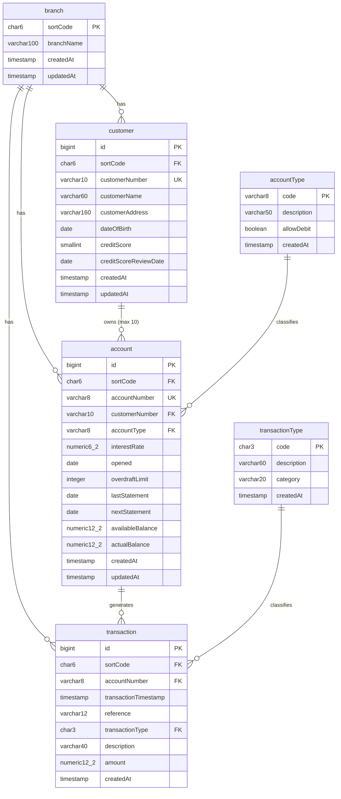

# Entity Relationship Diagram (New PostgreSQL Schema)



## Cardinality Rules

| Relationship | Cardinality | Business Rule |
|---|---|---|
| branch → customer | 1:N | A branch can have many customers |
| branch → account | 1:N | A branch can have many accounts |
| customer → account | 1:N (max 10) | A customer can have up to 10 accounts |
| account → transaction | 1:N | An account has many transactions (append-only) |
| accountType → account | 1:N | Each account has exactly one type |
| transactionType → transaction | 1:N | Each transaction has exactly one type |

## Index Strategy

```
┌─────────────────────────────────────────────────────────────────────────┐
│                         INDEX COVERAGE MAP                                │
├─────────────────────────────────────────────────────────────────────────┤
│                                                                          │
│  customer table:                                                         │
│  ┌──────────────────────────────────────────────────────────────┐       │
│  │ PK:    id                                                     │       │
│  │ UQ:    (sortCode, customerNumber)      ← original VSAM key   │       │
│  │ IDX:   customerName (pattern_ops)      ← name search API     │       │
│  └──────────────────────────────────────────────────────────────┘       │
│                                                                          │
│  account table:                                                          │
│  ┌──────────────────────────────────────────────────────────────┐       │
│  │ PK:    id                                                     │       │
│  │ UQ:    (sortCode, accountNumber)       ← original DB2 PK     │       │
│  │ IDX:   (sortCode, customerNumber)      ← customer lookup     │       │
│  │ IDX:   (sortCode, actualBalance)       ← balance queries     │       │
│  └──────────────────────────────────────────────────────────────┘       │
│                                                                          │
│  transaction table:                                                      │
│  ┌──────────────────────────────────────────────────────────────┐       │
│  │ PK:    id                                                     │       │
│  │ IDX:   (sortCode, transactionTimestamp) ← main query pattern │       │
│  │ IDX:   (sortCode, accountNumber)        ← account history    │       │
│  │ IDX:   transactionType                  ← type filtering     │       │
│  └──────────────────────────────────────────────────────────────┘       │
│                                                                          │
└─────────────────────────────────────────────────────────────────────────┘
```
