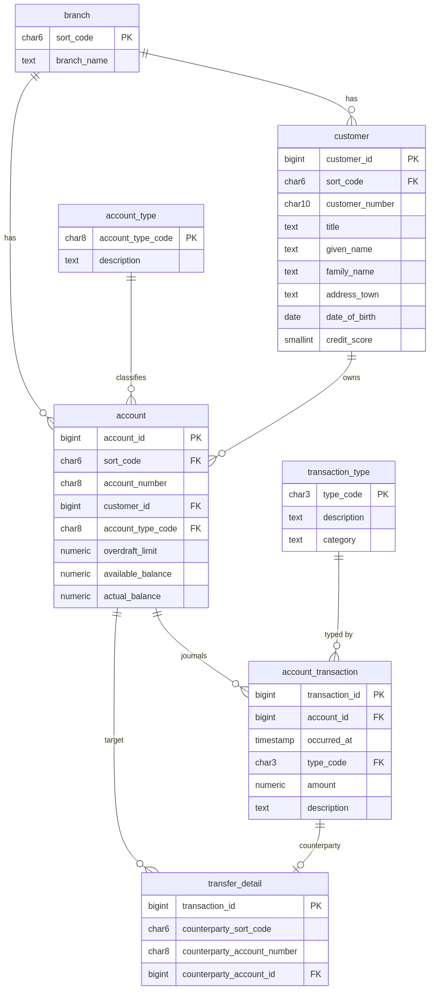
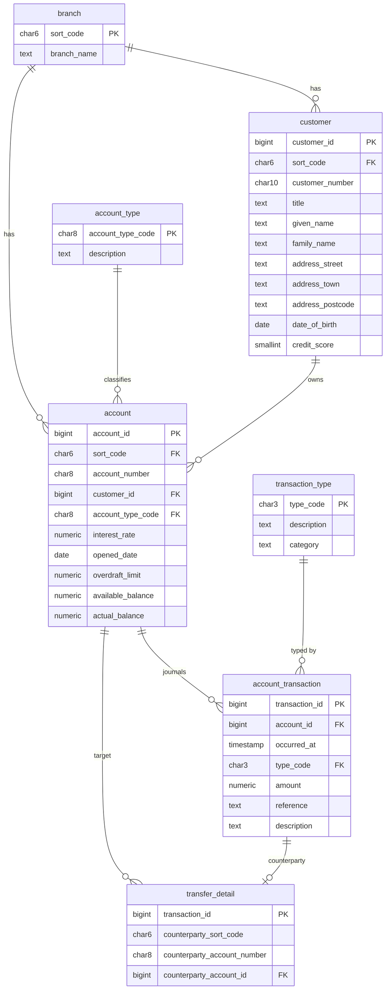

# CBSA PostgreSQL — Entity Relationship Diagram

The normalized target schema (schema `cbsa`).



Rendered by GitHub from Mermaid below (source in [`img/erd.mmd`](./img/erd.mmd)):



## Source → target overview

```
   Db2 / VSAM (CBSA)                         PostgreSQL (normalized, 3NF)
   ─────────────────                         ────────────────────────────
   CUSTOMER (VSAM KSDS) ───────┐             branch          (NEW, from sort code)
   ACCOUNT  (Db2)  ────────┐   ├──────────►  customer        (name/address split)
   PROCTRAN (Db2)  ──────┐ │   │             account_type    (NEW lookup)
   CONTROL  (Db2)  ─┐    │ │   └──────────►  account
                    │    │ └──────────────►  account_transaction
   sort code (dup   │    └────────────────►  transfer_detail (NEW, from DESC)
   in all 4)  ──────┘                        transaction_type(NEW lookup)
                                             account_number_seq / customer_number_seq (replace CONTROL)
                                             branch_account_count (VIEW, replaces CONTROL count)
```
