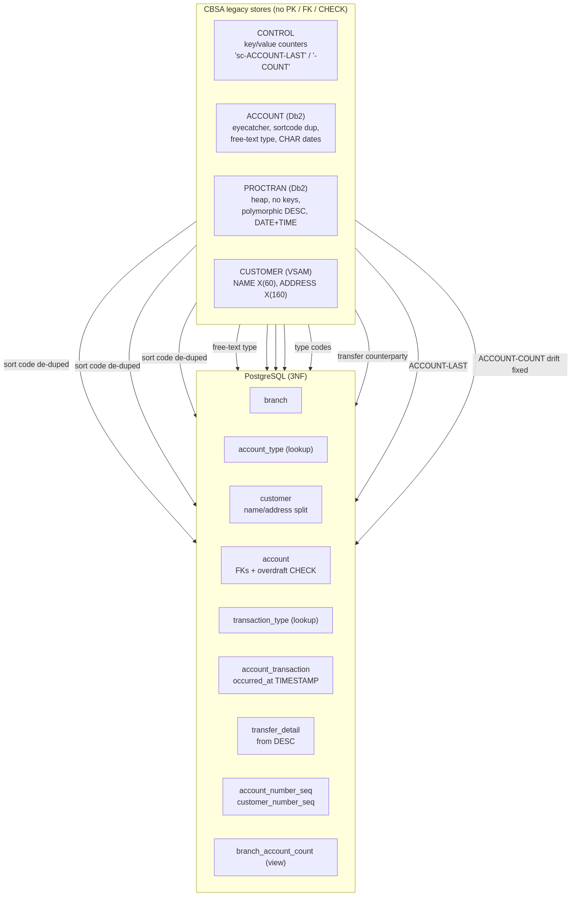

# CBSA Db2 → PostgreSQL Migration & Normalization

This document explains how the legacy CBSA data stores were re-modelled into the
normalized PostgreSQL schema under `postgres/schema`. It is built from the
per-table access-pattern analyses in this folder:

- [`ACCOUNT_analysis.md`](./ACCOUNT_analysis.md)
- [`PROCTRAN_analysis.md`](./PROCTRAN_analysis.md)
- [`CONTROL_analysis.md`](./CONTROL_analysis.md)

See [`ERD.md`](./ERD.md) for the entity-relationship diagram.

**How the four legacy stores map into the normalized schema:**



---

## 1. Source stores

| Source | Kind | Key (de-facto) | Constraints in CBSA |
|--------|------|----------------|---------------------|
| `ACCOUNT`  | Db2 table | `(SORTCODE, NUMBER)` unique index | **None** (no PK/FK/CHECK) |
| `PROCTRAN` | Db2 table | *none* (heap) | **None** |
| `CONTROL`  | Db2 table | `CONTROL_NAME` unique index | **None** |
| `CUSTOMER` | VSAM KSDS | `SORTCODE + NUMBER` | file key only |

Every relationship (account→customer, transaction→account, number generation)
was enforced only in COBOL/Java — nothing in the database.

---

## 2. Key problems found (and the fix)

### 2.1 Duplicated "sort code" → `branch` table
The 6-digit sort code was copied into `ACCOUNT`, `CUSTOMER`, `PROCTRAN`, and even
string-concatenated into `CONTROL_NAME` (`'<sortcode>-ACCOUNT-LAST'`).

```
BEFORE (repeated everywhere)                AFTER (referenced once)
────────────────────────────                ───────────────────────
ACCOUNT   .SORTCODE  987654                        branch(sort_code PK)
CUSTOMER  .SORTCODE  987654    ──normalize──►             ▲
PROCTRAN  .SORTCODE  987654                    account / customer / ...
CONTROL   "987654-ACCOUNT-LAST"                    FK → branch.sort_code
```

### 2.2 `CONTROL` EAV counter table → SEQUENCEs + a VIEW
`CONTROL` was a generic key/value store holding just two counters per sort code.
The read-modify-write on `ACCOUNT-LAST` was **race-prone** (no row lock between
SELECT and UPDATE) and `ACCOUNT-COUNT` **drifted** (DELACC never decremented it,
the web path never maintained it). `CONTROL_VALUE_STR` was always blank.

```
BEFORE                                       AFTER
──────                                       ─────
CONTROL                                      account_number_seq   (native SEQUENCE, atomic)
┌──────────────────────┬─────────┬────────┐ customer_number_seq  (native SEQUENCE, atomic)
│ CONTROL_NAME (str PK) │ NUM     │ STR    │
├──────────────────────┼─────────┼────────┤ branch_account_count (VIEW = COUNT(*), never drifts)
│ 987654-ACCOUNT-LAST   │ 34      │ ''     │
│ 987654-ACCOUNT-COUNT  │ 34 (?)  │ ''     │ -- CONTROL_VALUE_STR dropped (dead column)
└──────────────────────┴─────────┴────────┘
```

### 2.3 Polymorphic `PROCTRAN_DESC` → typed columns + `transfer_detail`
`PROCTRAN_DESC CHAR(40)` was a union parsed positionally by `PROCTRAN_TYPE`
(7+ COBOL `REDEFINES`). For a transfer it packed the counterparty sort code and
account number; for create/delete it packed customer number / name / DOB.

```
BEFORE  PROCTRAN row, TYPE='TFR'
  DESC = "TRANSFER                  9876540 0000041"
          └─ header(26) ─┘└sortcode┘└ account ┘   (positional, stringly-typed)

AFTER
  account_transaction(type_code='TFR', amount, occurred_at, ...)
        └──1:0..1──►  transfer_detail(counterparty_sort_code, counterparty_account_number,
                                      counterparty_account_id FK→account)
```

`PROCTRAN_TYPE`'s 18 magic 3-char codes became the `transaction_type` lookup
(with a `FINANCIAL` vs `LIFECYCLE` category).

### 2.4 `PROCTRAN` DATE/TIME chaos → one `TIMESTAMP`
`PROCTRAN_DATE` was declared three inconsistent ways (Db2 `DATE`, `CHAR(8)` host
var, `9(8)` record) and `PROCTRAN_TIME` was a separate `CHAR(6)`. Merged into a
single `occurred_at TIMESTAMP`.

### 2.5 `CUSTOMER` composite fields → decomposed columns
The COBOL copybook itself documented (as commented-out sub-fields) that
`CUSTOMER-NAME PIC X(60)` is really *title / given-name / initials / family-name*
and `CUSTOMER-ADDRESS PIC X(160)` is *street / district / town / postcode*.
These are split into typed columns (1NF: no composite attributes).

### 2.6 Storage artifacts dropped
`ACCOUNT`/`PROCTRAN`/`CUSTOMER` "eyecatcher" fillers (`'ACCT'`/`'PRTR'`/`'CUST'`),
the unused `X'FF'` logical-delete redefine, and fixed-width space/zero padding
(Java matched with `LIKE`!) are all gone. Money is `NUMERIC`, no CHAR-digit fields.

---

## 3. Normalization: which normal form and why

```
1NF  Atomic columns, no repeating groups.
     • CUSTOMER name/address split into components.
     • PROCTRAN_DESC positional union split out.

2NF  No partial dependency on part of a composite key.
     • Surrogate PKs (account_id, customer_id, transaction_id) replace the
       composite (sort_code, number) business keys (kept as UNIQUE).
     • Branch attributes depend on sort_code alone → moved to `branch`.

3NF  No transitive dependencies; lookups extracted.
     • account_type and transaction_type descriptions no longer stored per row.
     • Derived data (account count) is a VIEW, not a stored counter.
```

---

## 4. Column mapping (headline tables)

### ACCOUNT → `account`
| CBSA column | New column | Change |
|-------------|-----------|--------|
| `ACCOUNT_EYECATCHER` | *(dropped)* | constant filler |
| `ACCOUNT_SORTCODE` | `sort_code` (FK→branch) | de-duplicated |
| `ACCOUNT_NUMBER` | `account_number` | + surrogate `account_id` PK |
| `ACCOUNT_CUSTOMER_NUMBER` | `customer_id` (FK→customer) | real FK |
| `ACCOUNT_TYPE` | `account_type_code` (FK) | lookup |
| `ACCOUNT_INTEREST_RATE` | `interest_rate NUMERIC(6,2)` | precision reconciled |
| `ACCOUNT_OPENED` | `opened_date DATE` | true DATE |
| `ACCOUNT_OVERDRAFT_LIMIT` | `overdraft_limit NUMERIC(12,2)` | widened from INTEGER |
| `ACCOUNT_*_STATEMENT` | `last/next_statement_date` | true DATE |
| `ACCOUNT_*_BALANCE` | `available/actual_balance NUMERIC(12,2)` | + overdraft CHECK |

### PROCTRAN → `account_transaction` (+ `transfer_detail`)
| CBSA column | New column | Change |
|-------------|-----------|--------|
| `PROCTRAN_EYECATCHER` | *(dropped)* | filler + dead delete-flag |
| `PROCTRAN_SORTCODE/NUMBER` | `account_id` (FK→account) | real composite FK |
| `PROCTRAN_DATE` + `PROCTRAN_TIME` | `occurred_at TIMESTAMP` | merged |
| `PROCTRAN_REF` | `reference` | kept (was CICS task no., not unique) |
| `PROCTRAN_TYPE` | `type_code` (FK→transaction_type) | lookup |
| `PROCTRAN_DESC` | `description` + `transfer_detail.*` | decomposed |
| `PROCTRAN_AMOUNT` | `amount NUMERIC(12,2)` | — |

### CONTROL → sequences + view
| CBSA row/column | Replacement |
|-----------------|-------------|
| `'<sc>-ACCOUNT-LAST'` | `account_number_seq` |
| `'<sc>-ACCOUNT-COUNT'` | `branch_account_count` view |
| `CONTROL_VALUE_STR` | dropped (always blank) |
| customer numbering (VSAM counter) | `customer_number_seq` |

---

## 5. Behavioral notes for the application layer

- **Atomicity**: CBSA kept `ACCOUNT` balance updates and the `PROCTRAN` journal
  insert consistent via CICS `SYNCPOINT ROLLBACK`. In Postgres, wrap the balance
  update + `account_transaction` insert in one transaction.
- **Account/customer numbering**: use `nextval('cbsa.account_number_seq')` etc.
  instead of the read-increment-write of `CONTROL` (removes the race).
- **Multi-branch numbering**: CBSA numbers are per sort code. The demo uses a
  single global sequence; for many branches, use one sequence per branch or a
  `(sort_code, number)` allocator table.
- **Business rules now enforceable as constraints**: customer-exists (FK),
  natural-key uniqueness, overdraft limit (CHECK), credit-score range (CHECK).
  The "max 10 accounts per customer" rule is left to the app or a trigger.

---

## 6. Build & test locally

```bash
postgres/run_local.sh      # spins up postgres:16 in Docker, applies schema,
                           # seeds data, runs postgres/test/01_tests.sql
```
All eight constraint/behaviour tests must print `OK` and end with
`=== ALL SCHEMA TESTS PASSED ===`.
